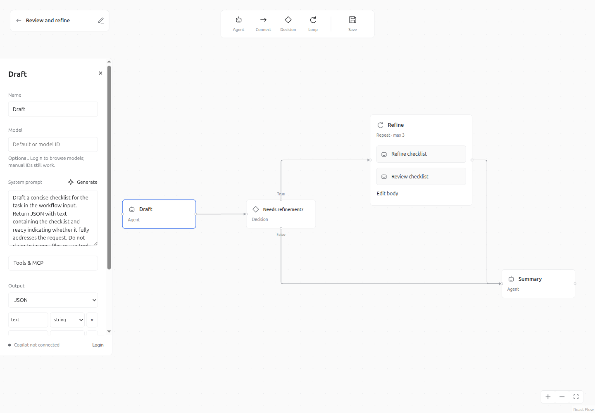

<p align="center">
  
</p>

# Blueprint

**Design GitHub Copilot workflows on a canvas. Keep the source in your repository.**

Blueprint is a local desktop editor for connecting agents, decisions, and bounded
loops into [GitHub Copilot dynamic workflows](https://docs.github.com/en/copilot/concepts/agents/dynamic-workflows).
Save an unfinished draft or export runnable workflow code and agent profiles.
Copilot login is optional; manual workflow authoring does not require an account.

> **Early-access project.** Blueprint and Copilot's dynamic-workflow interfaces
> are still evolving. Public release gates are tracked in
> [the release checklist](docs/RELEASING.md#release-gates).
> Cross-platform CI and candidate builds are provided, but are not evidence that
> signing, notarization, or real-account end-to-end testing has already happened.



## What you can build

- Agent graphs with explicit execution order and structured JSON handoffs.
- Deterministic True/False branches and bounded Repeat or sequential For-each loops.
- Agents with system/task prompts, optional models, tools, and MCP configuration.
- Editable `.blueprint.json` drafts, including incomplete workflows.
- Repository exports containing `extension.mjs`, `workflow.ts`, editable JSON,
  and `.agent.md` profiles.
- Optional Copilot-assisted system prompts: describe, generate, review, then apply.

Blueprint is an **authoring tool**, not a workflow runner. Saving, opening a graph,
or previewing a generated prompt does not execute the workflow.

## Get started

The candidate targets are **Ubuntu 24.04 x86_64** and **macOS 15+ on Apple Silicon
and Intel**. Other distributions, versions, architectures, and Windows are not
part of the current release matrix. macOS remains a release-verification gate.
See [known limitations](docs/ISSUES.md).

Until a reviewed release is published, build from source:

```sh
git clone https://github.com/LazaroHurtado/blueprint.git
cd blueprint
npm ci
npm run tauri dev
```

Install **Node.js 24**, Rust through **rustup**, and the native dependencies in
[development setup](docs/DEVELOPING.md) first. The project selects Rust 1.94.0.
The initial native build also downloads the pinned Copilot runtime.

For a browser-only preview, use `npm run dev`. Canvas editing and JSON import work;
native saving and Copilot integration require the desktop application.

Open [the example workflow](examples/review-and-refine.blueprint.json) to explore
agents, a decision, and a bounded loop without running anything.
The [user guide](docs/USER_GUIDE.md) covers the editor, branch semantics, drafts,
recovery, and exporting. Runnable exports require a compatible Copilot CLI,
authentication, and the permissions appropriate to their agents.

## Copilot, privacy, and cost

Login unlocks account-aware model discovery and prompt drafting. Generated text
does not replace a system prompt until you choose **Apply**. Generating a prompt
uses your Copilot allowance; it is not a free local model.

On desktop startup Blueprint can check an existing Copilot login and load its
model catalog. Optional login does **not** mean the process never makes network
requests before you click Login. Disconnect opts Blueprint out until you reconnect.
No Blueprint-hosted backend receives your workflows.

Read [privacy and data handling](docs/PRIVACY.md) before using Copilot assistance
with confidential descriptions or sharing diagnostics.

## Contribute

Bug reports, documentation, accessibility improvements, tests, and focused code
contributions are welcome. Start with [CONTRIBUTING.md](CONTRIBUTING.md).

| Topic | Guide |
| --- | --- |
| Development and project structure | [DEVELOPING.md](docs/DEVELOPING.md) |
| Workflow behavior and export format | [USER_GUIDE.md](docs/USER_GUIDE.md) |
| Bugs and verification boundaries | [ISSUES.md](docs/ISSUES.md) |
| Candidate builds and public release | [RELEASING.md](docs/RELEASING.md) |
| Help and feature requests | [SUPPORT.md](SUPPORT.md) |
| Private vulnerability reporting | [SECURITY.md](SECURITY.md) |
| Community standards and maintenance | [Code of conduct](CODE_OF_CONDUCT.md), [governance](GOVERNANCE.md) |

## License and affiliation

Blueprint's source code and original assets are **[MIT licensed](LICENSE)**.
Its bundled Copilot runtime and other dependencies retain their own terms;
see [third-party notices](THIRD_PARTY_NOTICES.md). Binary packages are not a
relicensing of GitHub's runtime under MIT.

Blueprint is an independent community project, not an official GitHub product.
GitHub and GitHub Copilot are trademarks of GitHub, Inc.
